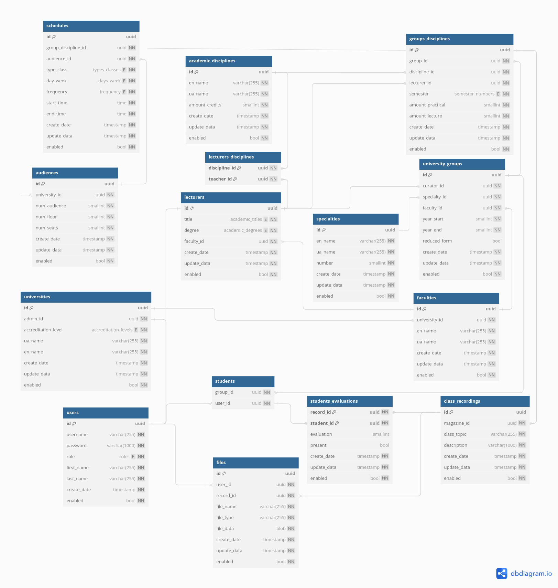
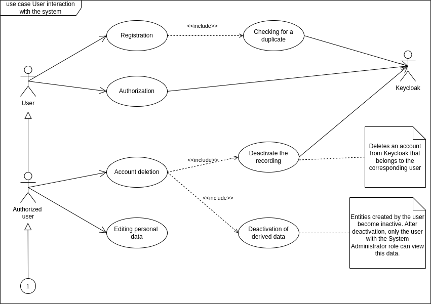
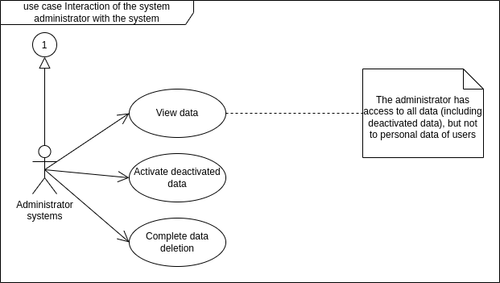
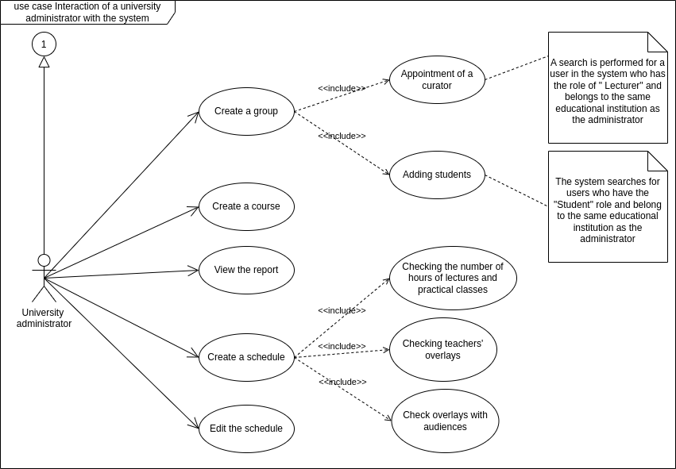
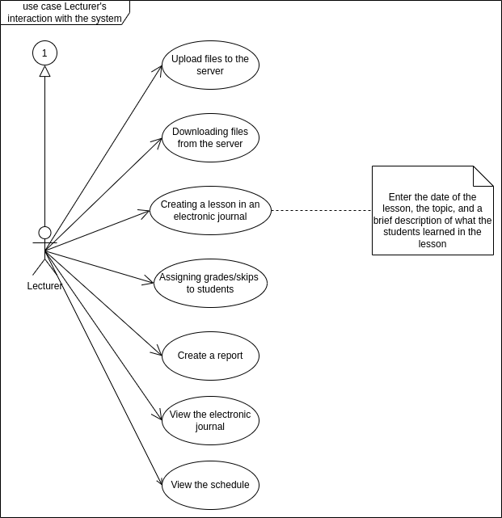
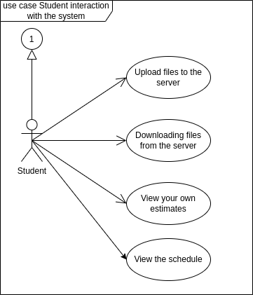

# The University Educational Process Organization System

## Overview

This project is a comprehensive integrated information system designed to optimize and streamline the educational processes within a university. It aims to address various existing issues and enhance the efficiency of all involved processes, including teaching, learning, and administrative tasks. By implementing this system, universities can benefit from centralized data storage, optimized resource planning, unified access to information, enhanced analytics, and reduced paper-based documentation.

## Key Features

- **Centralized Data Management**: All information related to the organization of education, such as curricula, student data, schedules, and academic performance, is stored in a single data repository. This eliminates fragmentation and incompatibility between different departments and facilitates data exchange.
- **Resource Planning Optimization**: Having comprehensive and up-to-date information on teaching loads, classroom occupancy, academic groups, etc., in a single system allows for optimized planning and resource allocation.
- **Unified Access**: With a web-oriented architecture and mobile device support, students, teachers, and administration have constant and quick access to current information through a unified interface from any location and device.
- **Flexibility and Expandability**: Using modern modular architecture and open standards ensures easy expansion of the system with new functionalities, integration with other products, and adaptation to future changes in requirements.
- **Enhanced Analytics and Reporting**: The presence of a unified structured data repository paves the way for applying modern methods of big data analysis, machine learning, and visualization to identify hidden trends, model different scenarios, and generate detailed reports.
- **Reduced Paperwork**: Converting most documents to electronic format, along with electronic signature capabilities and automated document generation, significantly reduces paper storage costs and accelerates document flow.
- **Resource Savings**: Optimizing resource use, automating processes, and minimizing paperwork contribute to cost and energy savings, thereby improving the economic status of the university.

## Technology Stack

- **Backend**: Java 17 with Spring Boot 3.2.3
- **Database**: PostgreSQL
- **Security**: JWT for authentication, SSL/TLS for data encryption and Keycloak

## Installation and Setup

1. **Clone the repository**:

   ```bash
   git clone https://github.com/BogdanPhoenix/organization_education_backend.git
   cd organization_education_backend
   ```

2. **Editing the .env:**

   - Rename the file .env.example to .env:

   ```bash
   mv .env.example .env
   ```

   - Open in the editor and fill in the environment variables

   ```bash
   nano .env
   ```

3. **Set up the backend**:
   - Navigate to the `backend` directory and install dependencies:
   ```bash
    cd backend
    ./mvnw install
   ```
   - Run the application:
   ```bash
   ./mvnw spring-boot:run
   ```

## Description of the system

## **The functional requirements for the system**

- Register in the web application (using your email or Google account).
- Authorization in the web application (using e-mail or Google account).
- Implementation of access levels for different categories of users (system administrator, university administration, teacher, student).
- Formation of courses (students) by the university administration.
- Editing of course (student) data by the university administration.
- Formation of a student group by the university administration.
- Editing of group data by the university administration.
- Assignment of a curator for the group by the university administration.
- Formation of a class schedule by the university's dispatching service:
  - editing the content of the schedule;
  - defining the type of lesson (lecture, practical, seminar, laboratory) for the discipline;
  - defining the classroom for the lesson (for a specific student group or course);
  - identification of the teacher who will conduct the class (for a specific student group or course);
  - forming the schedule according to the following rules:
    - checking that teachers do not have the same time for different academic disciplines;
    - checking the coincidence of time, classrooms, and teachers for streaming classes.
- Creating reports on the learning process:
  - control (monitoring) of classes by teachers;
  - control (monitoring) of student attendance;
  - entering student grades in the student grade-book by the teacher;
  - generating a report of the electronic journal of the discipline.
- Uploading data to the web application.
- Downloading files from the server.
- Viewing the electronic journal by a teacher in the discipline.
- Viewing only your own grades by a student in each discipline.
- Editing personal data.

## **Database**

The University Educational Process Organization System uses PostgreSQL as its primary database management system. This choice ensures robustness, scalability, and compatibility with modern web applications. Below are the details and instructions for setting up and managing the database.

### Database Schema

To make it easier to work with the subject area, we developed the database shown in the figure:



It includes tables for class schedules, classrooms, universities, users, students, teachers, disciplines, specialties, faculties, and academic groups.
The diagram also shows the relationships between the tables, reflecting the relationships between different aspects of the learning process, such as teaching a discipline, grouping students, scheduling classes, and storing assessment results.

### Setting Up the Database

1. **Install PostgreSQL**:
   Follow the instructions for your operating system from the [official PostgreSQL documentation](https://www.postgresql.org/docs/).

2. **Create a New Database**:
   After installing PostgreSQL, create a new database for the project:

   ```sql
   CREATE DATABASE organization_education_db;
   ```

3. **Configure the Application**:
   Update the `application.properties` (or `application.yml`) file in the `src/main/resources` directory with your PostgreSQL database credentials:

```
spring.datasource.url=jdbc:postgresql://localhost:5432/organization_education_db
spring.datasource.username=yourUsername
spring.datasource.password=yourPassword
spring.jpa.hibernate.ddl-auto=update
spring.jpa.show-sql=true
```

4. **Run Database Migrations**:
   Use the provided migration scripts (if any) to set up the initial database schema. This can typically be done using tools like Flyway or Liquibase. Ensure the scripts are configured to run on application startup or manually execute them:
   ```bash
   ./mvnw flyway:migrate
   ```

### Managing the Database

- **Connecting to the Database**:
  Use a tool like pgAdmin or DBeaver to connect to the PostgreSQL database for management and querying purposes.
- **Backing Up the Database**:
  Regularly back up your database to prevent data loss. This can be done using the `pg_dump` utility:
  ```bash
  pg_dump -U yourUsername -F c -b -v -f backupFile.backup organization_education_db
  ```
- **Restoring the Database**:
  To restore a backup, use the `pg_restore` utility:
  ```bash
  pg_restore -U yourUsername -d organization_education_db -v backupFile.backup
  ```

### Database Best Practices

- **Indexing**: Ensure frequently queried fields are indexed for better performance.
- **Normalization**: Follow normalization principles to reduce redundancy and improve data integrity.
- **Security**: Regularly update PostgreSQL to the latest version, restrict access to the database, and use strong passwords.

## **Backend**

The following roles have been implemented in the system: system administrator, university administrator, teacher, and student.
The following UML diagrams demonstrate how the system is used depending on the user's role. All roles are derived from the "Authorized User" role, which in turn is derived from the "User" role.











## **Security**

To protect users' personal data, we used the Keycloak service, which is an open access and identification management system that allowed us to centrally manage user authentication and user authorization. 

SSL (Secure Sockets Layer) and TLS (Transport Layer Security) protocols were used to ensure the confidentiality and integrity of data during its transmission over the network, protecting it from interception and modification.

To authenticate in the system, the user contacts the server and provides his or her username and password. After the credentials are successfully verified, the server generates a temporary Bearer token that is sent to the user. This token contains the necessary information to establish communication with the system, but does not store any confidential user data, such as login or password. Using a Bearer token instead of transmitting credentials in clear text increases security and confidentiality, as it prevents this sensitive information from being intercepted.
